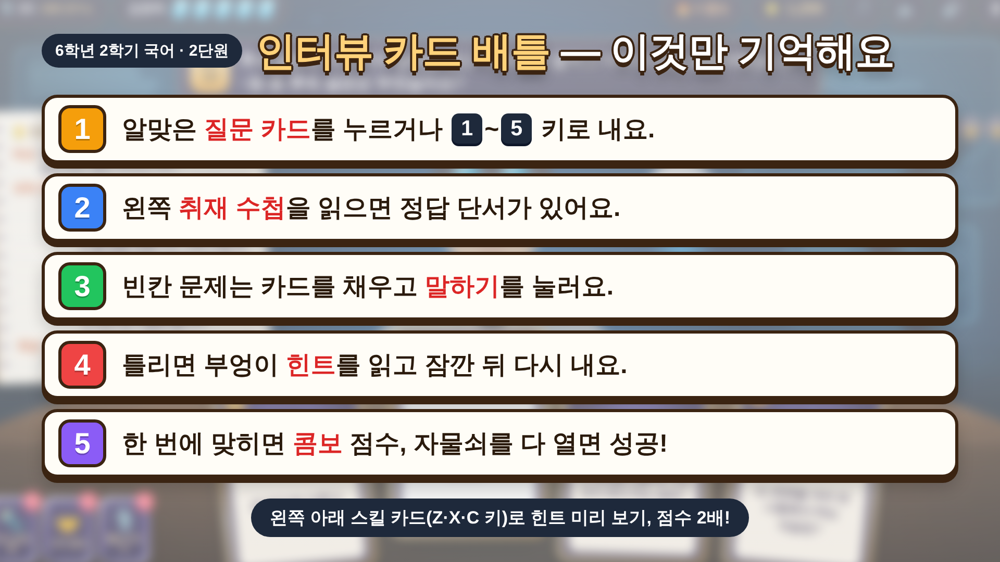

🎯 게임 목적
**6학년 2학기 국어 「2. 궁금한 점을 해결해요」**를 복습하는 게임입니다. 학생은 어린이 기자가 되어 5명을 차례로 인터뷰하며, 면담 준비부터 요청·진행·질문 만들기·보고서 쓰기까지 면담의 전 과정을 다시 익힙니다.

📝 내용과 특징
- 문제는 **20문항**입니다. 위쪽 질문과 왼쪽 **취재 수첩**(면담 대화 지문)을 읽고 알맞은 카드를 내면 인터뷰 대상의 마음 문 자물쇠가 하나씩 열립니다.
- 인터뷰 대상 5명(떨림이 → 한서린 사서 → 도윤재 박사 → 물음표 백지 → 윤하늘 선생님)이 단원 순서대로 나옵니다.
- 답하는 방법은 카드 한 장 내기, 빈칸에 낱말 카드 채우고 말하기, 친구 카드 내기의 3가지입니다.
- 카드 순서는 판마다 섞이고 정답 자리도 고르게 나뉘어, 위치를 외워서는 풀 수 없습니다.
- 인터뷰를 마칠 때마다 스킬 카드를 1장 고르고, 지도에서 휴식이나 보물을 골라 덱을 키웁니다. 결과 화면에는 점수·등급·별(15개 만점)과 **오답 노트**가 나옵니다.

🎮 조작 및 가이드
- **① 기자증에 이름 쓰기 → ② 취재 시작 → ③ 취재 지도에서 다음 인터뷰 대상 누르기** 순서로 시작합니다.
- 마우스·터치: 카드를 눌러 냅니다. 빈칸 문제는 카드를 눌러 빈칸을 채우고(찬 빈칸을 누르면 빠짐) 🎤 **말하기**를 누릅니다.
- 키보드: 1~5 카드 내기, Enter 말하기·다음, Backspace 빈칸 빼기, Z·X·C… 스킬, R 읽어 주기, M 배경음악, Esc 멈춤입니다.
- 수첩의 '📜 전체 기록'을 누르면 면담 대화 전체를 크게 볼 수 있습니다.
- PC(마우스·키보드), 태블릿, 휴대폰(터치)에서 모두 할 수 있습니다.

❓ 모든 문제와 정답
(게임에서는 보기 카드의 순서가 판마다 섞입니다. 아래 ①~⑤는 원래 순서입니다.)

**[인터뷰 1. 면담 준비실 · 떨림이] 4문항**

| 번호 | 난이도 | 문제 | 정답 |
|---|---|---|---|
| 1 | 하 | 그림 속 친구들은 무엇을 하고 있을까요? ① 소방관님과 면담을 진행하고 있다. ② 소방관님과의 면담 후 보고서를 쓰고 있다. ③ 소방관님과 면담을 하기 전에 준비할 일에 대해 이야기하고 있다. | ③ 소방관님과 면담을 하기 전에 준비할 일에 대해 이야기하고 있다. |
| 2 | 중 | 면담을 할 때 준비해야 할 것으로 알맞지 않은 것은 무엇일까요? ① 면담 목적을 정한다. ② 면담 역할을 정한다. ③ 면담 대상자를 정한다. ④ 면담에 필요한 자료를 찾는다. ⑤ 면담 대상자가 할 답변을 모둠원이 미리 정해 둔다. | ⑤ 면담 대상자가 할 답변을 모둠원이 미리 정해 둔다. |
| 3 | 하 | 다음 중 면담하는 모습으로 알맞은 것은 무엇일까요? ① 어린이 기자가 소방관에게 궁금한 점을 묻고 답을 듣는다. ② 친구들과 모여 쉬는 시간 놀이 규칙을 정한다. ③ 도서관에서 혼자 책을 찾아 읽는다. | ① 어린이 기자가 소방관에게 궁금한 점을 묻고 답을 듣는다. |
| 4 | 중 | 면담의 특성을 떠올리며 빈칸에 알맞은 카드를 넣어요. (1) 대화를 주고받는 과정에서 [빈칸1] 을/를 얻는다. / (2) 면담할 때에는 [빈칸2] 을/를 지키는 것이 중요하다. / (3) 사전 [빈칸3] 이/가 필요하다. (카드: 예의, 이해, 정보, 준비) | 빈칸1 정보 / 빈칸2 예의 / 빈칸3 준비 |

**[인터뷰 2. 시립 도서관 · 한서린 사서] 4문항**

| 번호 | 난이도 | 문제 | 정답 |
|---|---|---|---|
| 5 | 중 | 이 면담의 면담 대상자와 면담 목적을 카드로 채워요. 면담 대상자: [빈칸1] / 면담 목적: [빈칸2] (카드: 도서관 사서, 로봇 공학자, 친구들에게 사서라는 직업을 알리는 글을 쓰려고, 도서관에서 책을 빌리려고) | 빈칸1 도서관 사서 / 빈칸2 친구들에게 사서라는 직업을 알리는 글을 쓰려고 |
| 6 | 중 | 면담 역할 정하기에서 장윤서가 맡은 역할은 무엇일까요? ① 약속 담당 ② 녹음·녹화 담당 ③ 면담 진행 담당 ④ 질문 만들기 담당 ⑤ 면담 내용 정리 담당 | ③ 면담 진행 담당 |
| 7 | 하 | (수첩: 이 면담은 대상자를 직접 만나 마주 보고 이야기하는 (      ) 방식으로 진행되었다.) 빈칸에 들어갈 알맞은 면담 방식은 무엇일까요? ① 대면 면담 ② 비대면 면담 | ① 대면 면담 |
| 8 | 중 | (사서의 답변: “잘 듣고 설명하는 소통 능력, 자료를 찾아내는 검색 능력, 정확히 정리하는 꼼꼼함이 가장 중요하다고 생각해요.”) 사서의 답변에 알맞은 질문은 무엇일까요? ① 사서에게 가장 필요한 능력은 무엇인가요? ② 근무하시면서 가장 보람을 느꼈던 순간은 언제인가요? ③ 사서가 되고 싶은 학생들에게 해 주고 싶은 말씀은 무엇인가요? | ① 사서에게 가장 필요한 능력은 무엇인가요? |

**[인터뷰 3. 로봇 연구소 · 도윤재 박사] 4문항**

| 번호 | 난이도 | 문제 | 정답 |
|---|---|---|---|
| 9 | 중 | 로봇 공학자에게 면담을 요청할 때 해야 할 일로 알맞지 않은 것은 무엇일까요? ① 자기소개하기 ② 감사 인사하기 ③ 면담 약속 정하기 ④ 녹음이나 녹화 허락 구하기 ⑤ 로봇 공학자가 된 까닭 묻기 | ⑤ 로봇 공학자가 된 까닭 묻기 |
| 10 | 상 | 후속 질문은 대상자의 답변을 듣고 더 자세히 알려고 이어서 하는 질문이에요. ㉠~㉣ 중 후속 질문은 무엇일까요? ① ㉠ 로봇을 만들 때 가장 먼저 해야 하는 일은? ② ㉡ 로봇을 여러 번 시험해야 하는 까닭은? ③ ㉢ 로봇 공학자가 된 뒤에 가장 보람 있었던 순간은? ④ ㉣ 앞으로 이루고 싶은 목표는? | ② ㉡ 로봇을 여러 번 시험해야 하는 까닭은? |
| 11 | 하 | 로봇을 여러 번 시험해야 하는 까닭으로 알맞지 않은 것을 골라 × 카드로 내요. ① 성능을 점점 향상할 수 있어서 ② 로봇의 오류를 발견할 수 있어서 ③ 많은 사람에게 관심을 받고 싶어서 | ③ 많은 사람에게 관심을 받고 싶어서 |
| 12 | 중 | 면담을 진행하면서 녹음·녹화를 하면 좋은 점은 무엇일까요? ① 면담 내용을 정확하게 남겨 나중에 다시 확인할 수 있다. ② 대상자의 허락 없이 인터넷에 올릴 수 있다. ③ 질문을 미리 준비하지 않아도 된다. ④ 면담 시간이 저절로 줄어든다. | ① 면담 내용을 정확하게 남겨 나중에 다시 확인할 수 있다. |

**[인터뷰 4. 질문 설계실 · 물음표 백지] 5문항**

| 번호 | 난이도 | 문제 | 정답 |
|---|---|---|---|
| 13 | 하 | 이 표는 면담 절차 중 어느 단계에 해당할까요? ① 면담 열기 ② 질문하기 ③ 면담 마무리하기 | ② 질문하기 |
| 14 | 상 | ㉠~㉢에 들어갈 질문의 종류를 카드로 채워요. ㉠ [빈칸1] / ㉡ [빈칸2] / ㉢ [빈칸3] (카드: 생각이나 느낌에 대한 질문 하기, 구체적인 사실에 대한 질문 하기, 앞으로의 계획이나 당부에 대한 질문 하기) | 빈칸1 구체적인 사실에 대한 질문 하기 / 빈칸2 생각이나 느낌에 대한 질문 하기 / 빈칸3 앞으로의 계획이나 당부에 대한 질문 하기 |
| 15 | 중 | ㉣ 질문에 대한 면담 대상자의 답변으로 알맞은 것은 무엇일까요? ① 현대 사회에서 정신 건강의 중요성이 점점 커지고 있기에 앞으로 전망이 매우 밝다. ② 상담 교사는 학생들이 학교생활에서 겪는 고민을 들어 주고 해결 방법을 찾을 수 있도록 도와준다. ③ 상담 교사는 다양한 사람의 고민을 듣고 도와야 하는 직업이기 때문에 정신적으로 힘들 때가 많다. | ① 현대 사회에서 정신 건강의 중요성이 점점 커지고 있기에 앞으로 전망이 매우 밝다. |
| 16 | 상 | 매체를 고려해 진행한 면담 과정을 바르게 이해하지 못한 친구는 누구일까요? ① 정은: 나는 면담을 준비할 때 면담 대상자에게 직접 전화해서 정보를 모았어. ② 성미: 나는 면담을 진행할 때 면담 대상자에게 먼저 동의를 구하고 녹화를 했어. ③ 현철: 나는 면담을 정리할 때 면담 내용을 메모하고 녹화한 자료를 활용해서 면담 보고서를 썼어. | ① 정은: 나는 면담을 준비할 때 면담 대상자에게 직접 전화해서 정보를 모았어. |
| 17 | 중 | 면담 보고서의 특징에 맞게 빈칸에 알맞은 카드를 넣어요. (1) 면담을 마친 뒤 깨달은 점과 달라진 생각 → [빈칸1] / (2) 면담을 시작하며 세웠던 계획과 준비 상황 → [빈칸2] / (3) 궁금했던 점에 대해 대상자가 들려준 내용 → [빈칸3] (카드: 앞부분, 가운데 부분, 뒷부분) | 빈칸1 뒷부분 / 빈칸2 앞부분 / 빈칸3 가운데 부분 |

**[인터뷰 5. 상담실 · 윤하늘 선생님] 3문항**

| 번호 | 난이도 | 문제 | 정답 |
|---|---|---|---|
| 18 | 상 | 이 글에 대한 설명으로 알맞지 않은 것은 무엇일까요? ① (가)는 면담 진행하기 중 면담 열기이다. ② (나)는 면담 진행하기 중 면담 마무리하기이다. ③ (가)에서 민수는 면담 목적을 설명하였다. ④ (가)에서 기철이는 녹음·녹화 동의 구하기를 하였다. ⑤ (나)에서 민수는 면담 대상자에게 질문을 하였다. | ⑤ (나)에서 민수는 면담 대상자에게 질문을 하였다. |
| 19 | 하 | ㉠에 들어갈 말로 알맞은 것은 무엇일까요? ① 질문 ② 답변 ③ 정보 | ① 질문 |
| 20 | 중 | ㉡(녹화)에 대해 바르게 설명한 친구는 누구일까요? ① 호영: 면담 내용을 녹화한 자료는 다양한 곳에 두루 활용할 수 있어. ② 성희: 면담 내용을 녹화한 자료는 면담 보고서를 쓸 때에만 활용해야 해. ③ 정훈: 면담 내용을 녹화한 자료는 인터넷에 올려 많은 사람이 보게 해야 해. | ② 성희: 면담 내용을 녹화한 자료는 면담 보고서를 쓸 때에만 활용해야 해. |

💡 플레이팁
- 한 번에 맞혀야 점수가 큽니다. 처음에 맞히면 **100점 + 콤보 보너스(최대 +100)**, 다시 풀어 맞히면 40점입니다. 별도 한 번에 맞힌 비율로 정해집니다.
- 틀리면 집중력이 1 줄고 콤보가 끊깁니다. 부엉이 편집장의 힌트를 읽는 동안 잠깐 카드를 낼 수 없어서 아무 카드나 찍으면 손해입니다.
- 집중력이 0이 되면 '숨 고르기'로 3칸을 되찾지만 150점이 깎입니다.
- 어려운 문제에는 스킬 카드를 씁니다. 🔦 단서 손전등은 힌트를 미리 보여 주고, 🤝 끄덕 공감은 다음 정답 점수를 2배로 만듭니다.
- 학교 PC가 느리면 톱니바퀴나 멈춤 화면에서 **효과 줄이기**를 켜 주세요. 최고 점수와 별만 저장되고 중간 이어하기는 없으니 한 판을 끝까지 하게 해 주세요.

📺 교실 TV 안내판

이것만 기억해요
1. 알맞은 질문 카드를 누르거나 1~5 키로 내요.
2. 왼쪽 취재 수첩을 읽으면 정답 단서가 있어요.
3. 빈칸 문제는 카드를 채우고 말하기를 눌러요.
4. 틀리면 부엉이 힌트를 읽고 잠깐 뒤 다시 내요.
5. 한 번에 맞히면 콤보 점수, 자물쇠를 다 열면 성공!
(맨 아래 한 줄) 왼쪽 아래 스킬 카드(Z·X·C 키)로 힌트 미리 보기, 점수 2배!

================================================================

<학생 공유 방법 2가지>

1. HTML 파일 학생 공유
2. 아래 사이트 공유
   https://gudtbsl123-alt.github.io/hs7733/
